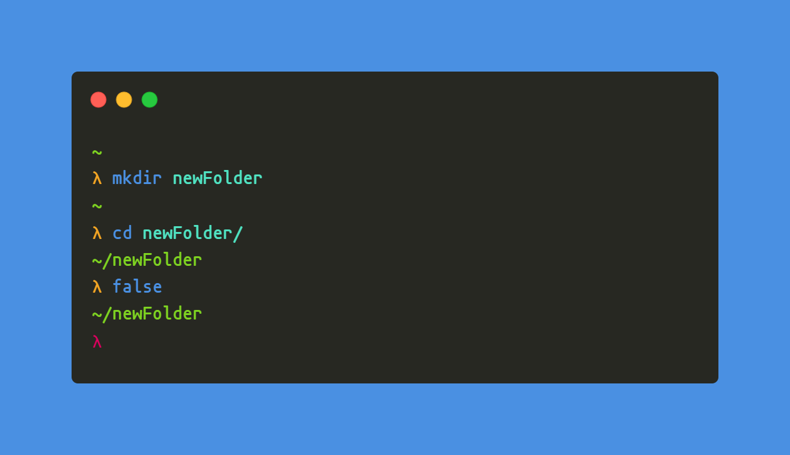

#### LambdaOMF
> A theme for [Oh My Fish](https://www.github.com/oh-my-fish/oh-my-fish).

<br/>


## Install

```fish
omf install https://github.com/LBY-L/LambdaOMF
```

## Features

* Awesome λ prompt.
* Minimalistic theme.

## Screenshot

<p align="center">

</p>


# License
[!original author](https://github.com/marcin-dudek)
